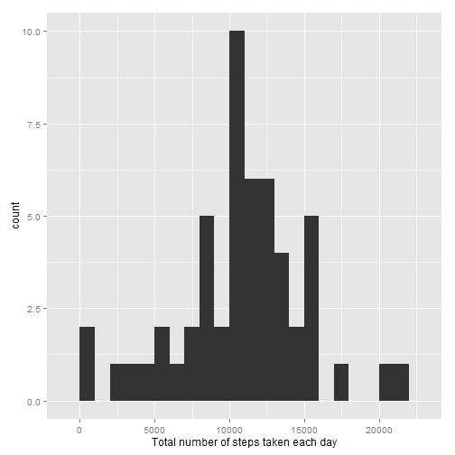
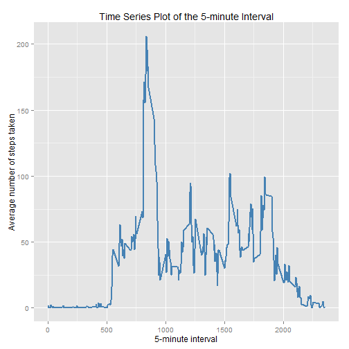

## Loading and preprocessing the data
- Downloaded data zip file and unzip file into current working directory

- Read data from activity.csv file

- Format date into YYYY-MM-DD format

```r
zfname <- "activity.zip"
# Unzip file and get Data file in working dir
unzip(zfname)
# Read file activity and create data set table
ActvityDS <- read.table('activity.csv' , sep="," , header = TRUE)
str(ActvityDS)
```

```
## 'data.frame':	17568 obs. of  3 variables:
##  $ steps   : int  NA NA NA NA NA NA NA NA NA NA ...
##  $ date    : Factor w/ 61 levels "2012-10-01","2012-10-02",..: 1 1 1 1 1 1 1 1 1 1 ...
##  $ interval: int  0 5 10 15 20 25 30 35 40 45 ...
```

```r
head(ActvityDS)
```

```
##   steps       date interval
## 1    NA 2012-10-01        0
## 2    NA 2012-10-01        5
## 3    NA 2012-10-01       10
## 4    NA 2012-10-01       15
## 5    NA 2012-10-01       20
## 6    NA 2012-10-01       25
```

## What is mean total number of steps taken per day?
- Histogram of the total number of steps taken each day

 

- The mean of the total number of steps taken per day

```r
mean(activityperday$Steps, na.rm=TRUE)
```

```
## [1] 10766.19
```

- The median of the total number of steps taken per day

```r
median(activityperday$Steps , na.rm=TRUE)
```

```
## [1] 10765
```

## What is the average daily activity pattern?
- calculate avarage(mean) number of steps by inteval
- plot the 5-minute interval (x-axis) and the average number of steps taken (y-axis)


```r
library(ggplot2)
averages <- aggregate(x=list(Steps=ActvityDS$steps), by=list(Interval=ActvityDS$interval),
                      FUN=mean, na.rm=TRUE)
ggplot(data=averages, aes(x=Interval, y=Steps)) +
    geom_line(color = "steelblue", size = 0.8)  +
    labs(title ="Time Series Plot of the 5-minute Interval" ,
    x="5-minute interval" ,
    y="Average number of steps taken")
```

 

- 5-minute interval, on average across all the days in the dataset, that contains the maximum number of steps


```r
averages[which.max(averages$Steps),]
```

```
##     Interval    Steps
## 104      835 206.1698
```

## Imputing missing values
There are a number of days/intervals where there are missing values (coded as NA).
The presence of missing days may introduce bias into some calculations or summaries of the data.

- Total number of missing values in the dataset (i.e. the total number of rows with NAs)


```r
# How many missing values for steps
sum(is.na(ActvityDS$steps))
```

```
## [1] 2304
```

My strategy is to use the mean for that 5-minute interval to fill each NA value in the steps column.

All of the missing values are filled in with mean value for that 5-minute interval.


```r
#Replace each missing value with the mean value of its 5-minute interval
repNAvalue <- function(steps, interval) {
    repval <- NA
    if (!is.na(steps))  
      repval <- c(steps)
    else
      repval <- (averages[averages$Interval==interval, "Steps"])
    repval
    return(repval)
}
ActvityDSNoNA <- ActvityDS
ActvityDSNoNA$steps <- mapply(repNAvalue, ActvityDSNoNA$steps, ActvityDSNoNA$interval)
str(ActvityDSNoNA)
```

```
## 'data.frame':	17568 obs. of  3 variables:
##  $ steps   : num  1.717 0.3396 0.1321 0.1509 0.0755 ...
##  $ date    : Factor w/ 61 levels "2012-10-01","2012-10-02",..: 1 1 1 1 1 1 1 1 1 1 ...
##  $ interval: int  0 5 10 15 20 25 30 35 40 45 ...
```

```r
head(ActvityDSNoNA)
```

```
##       steps       date interval
## 1 1.7169811 2012-10-01        0
## 2 0.3396226 2012-10-01        5
## 3 0.1320755 2012-10-01       10
## 4 0.1509434 2012-10-01       15
## 5 0.0754717 2012-10-01       20
## 6 2.0943396 2012-10-01       25
```
- Histogram of the total number of steps taken each day

```r
#total.steps <- tapply(ActvityDSNoNA$steps, ActvityDSNoNA$date, FUN=sum)
#qplot(total.steps, binwidth=1000, xlab="Total number of steps taken each day")

library(ggplot2)
ActvityDSNoNAperday <- aggregate( x=list(Steps=ActvityDSNoNA[, 'steps']), 
                             by = list(Day=ActvityDSNoNA$date), 
                             FUN = sum ,na.rm=TRUE)
qplot(ActvityDSNoNAperday$Steps, geom="histogram",binwidth=1000,  
                            xlab = "Total number of steps taken each day")
```

 

- calculate the mean  total number of steps.

```r
mean(ActvityDSNoNAperday$Steps, na.rm=TRUE)
```

```
## [1] 10766.19
```

- calculate the  median total number of steps.

```r
median(ActvityDSNoNAperday$Steps)
```

```
## [1] 10766.19
```
- After imputing (replacing) missing `steps` values with the mean `steps` of associated `interval` value, the new mean of total steps taken per day is the same as that of the before imputing data set; but the new(imputing missing values dataset) median of total steps taken per day is greater than that of the old(prior imputing dataset) median.

## Are there differences in activity patterns between weekdays and weekends?

- Create a new factor variable in the dataset with two levels -- "weekday" and "weekend" indicating whether a given date is a weekday or weekend day


```r
library(lubridate)
ActvityDSNoNA$weekdays <- factor(weekdays(ymd(as.character(ActvityDSNoNA$date)), abbreviate=FALSE))
levels(ActvityDSNoNA$weekdays) <- list( weekday = c("Monday", "Tuesday","Wednesday", "Thursday", "Friday"), 
      weekend = c("Saturday", "Sunday")
    )
  table (ActvityDSNoNA$weekdays)
```

```
## 
## weekday weekend 
##   12960    4608
```

- Make a panel plot containing a time series plot (i.e. type = "l") of the 5-minute interval (x-axis) and the average number of steps taken, averaged across all weekday days or weekend days (y-axis).


```r
averagesweekdays <- aggregate(x=list(Steps=ActvityDSNoNA$steps), by=list(Interval=ActvityDS$interval, ActvityDSNoNA$weekdays ),  FUN=mean, na.rm=TRUE)
library(lattice)
xyplot(averagesweekdays$Steps ~ averagesweekdays$Interval | averagesweekdays$Group.2, layout = c(1, 2), type = "l", xlab = "Interval", ylab = "Number of steps")
```

 
